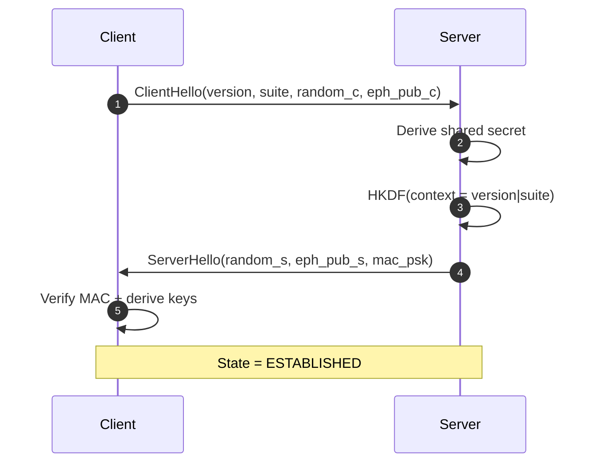
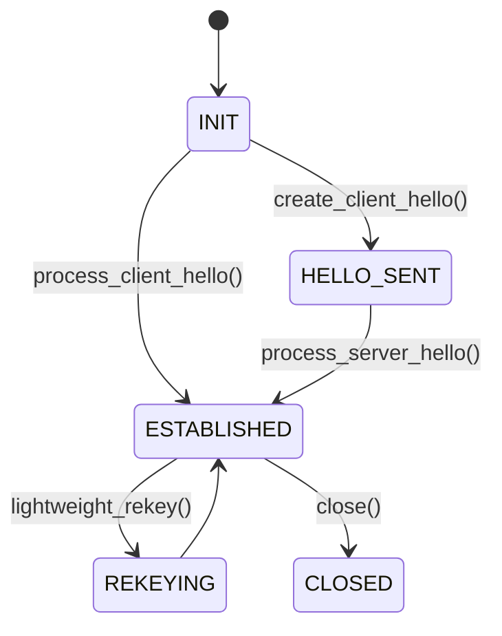
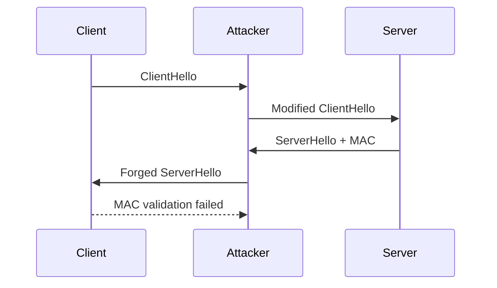
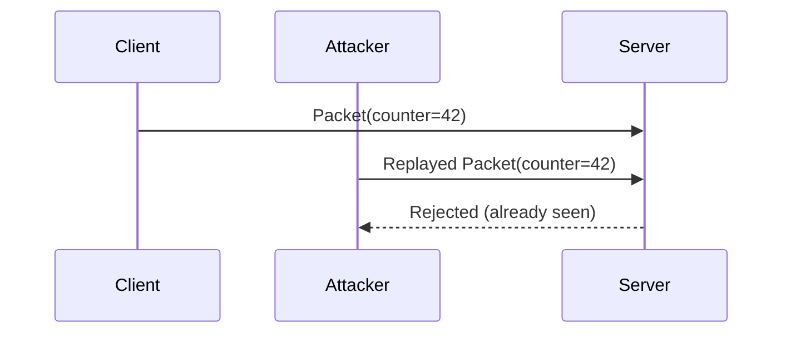
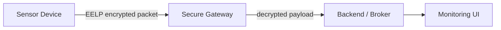

# 🔐 EELP — Evolutionary Efficient Lightweight Protocol

<p align="center">
  
  
  
  
  
  
  
</p>

<p align="center">
  <b>Minimalistic • Evolvable • Secure-by-Design • Embedded Friendly</b>
</p>

---

## 🌍 Что это

**EELP** — лёгкий протокол защищённого канала для устройств с ограниченными ресурсами (IoT, embedded, edge-gateway).

В репозитории реализован **практический reference-прототип**:

- 1-RTT handshake
- state machine протокола
- защита от replay
- защита от downgrade через context binding
- шифрование прикладных сообщений
- lightweight rekey

> ⚠️ Важно: текущая реализация — демонстрационная, ориентирована на понятную и воспроизводимую протокольную логику. Для production следует заменить криптопримитивы на промышленный стек (например, X25519 + ChaCha20-Poly1305 из battle-tested библиотек).

---

## 🧱 Архитектура и крипто-стек (текущий прототип)

| Слой | Используется в репозитории | Назначение |
|------|-----------------------------|------------|
| KEX | Ephemeral DH (mod p) | общий секрет с Forward Secrecy-подходом |
| KDF | HKDF-SHA256 | вывод сессионных ключей |
| Integrity | HMAC-SHA256 | MAC handshake + теги пакетов |
| Encryption | Stream-XOR (HMAC keystream) | шифрование payload |
| Anti-Replay | Sliding Window (32) | отсев повторов пакетов |

---

## 🤝 Handshake (1 RTT)



### Что защищает handshake

- **MITM-подмена**: через MAC `ServerHello` (на PSK).
- **Downgrade**: версия/сьют включены в HKDF context.
- **FS-подход**: используются эфемерные ключи на сессию.

---

## 🧠 State Machine



---

## ⚔️ Сценарии атак и защита

### 1) MITM (подмена handshake)



✅ Защита: MAC на `ServerHello` + привязка к параметрам handshake.

---

### 2) Downgrade (принудительный старый suite/version)

```mermaid
flowchart LR
    C[Client wants v1|suiteA] --> A[Attacker]
    A -->|tries rewrite| S[Server]
    S --> A --> C
    C --> X[HKDF context mismatch]
```

✅ Защита: `context = version|suite`, изменение параметров ломает проверку целостности сессии.

---

### 3) Replay (повтор зашифрованного пакета)



✅ Защита: Sliding Window + bitmap на 32 последних counter.

---

## 🚦 Реальное применение: шифрование трафика датчиков

Ниже пример практического сценария: **датчик температуры** шифрует данные перед отправкой на шлюз.



### Пример кода

```python
from eelp.protocol import EELPPeer

psk = b"demo-static-psk-for-mac"

# Инициализация ролей
client = EELPPeer(psk=psk, role="client")   # датчик
server = EELPPeer(psk=psk, role="server")   # шлюз

# 1-RTT handshake
client_hello = client.create_client_hello()
server_hello = server.process_client_hello(client_hello)
client.process_server_hello(server_hello)

# Шифрование телеметрии
packet = client.encrypt(
    b'{"device":"temp-01","value":23.7,"unit":"C"}',
    aad=b"topic:sensors/temp"
)

# Расшифровка на шлюзе
plaintext = server.decrypt(packet, aad=b"topic:sensors/temp")
print(plaintext.decode())
```

---

## 🗂 Структура репозитория

- `eelp/protocol.py` — core-реализация протокола
- `eelp/__init__.py` — экспорт API
- `tests/test_protocol.py` — тесты handshake/encryption/replay/tamper

---

## ▶️ Быстрый старт

```bash
python -m unittest discover -s tests -v
```

---

## 📌 Ограничения прототипа

- Reference-уровень, не production-ready crypto stack.
- Нет встроенного транспорта (UDP/TCP/Serial) — только протокольный слой.
- Нет долгоживущего хранилища сессий и автоматического key rotation policy.

---

## 👤 Автор

**nestren**

Идея и направление протокола: эволюционный lightweight secure channel для embedded и IoT.

---

## 📜 License

MIT
