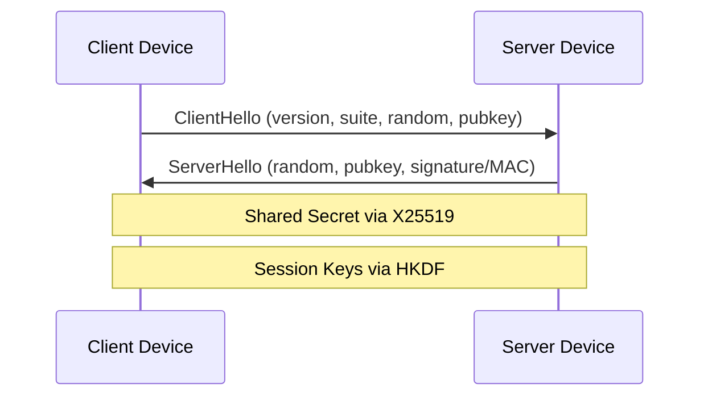
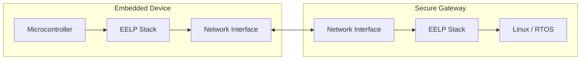
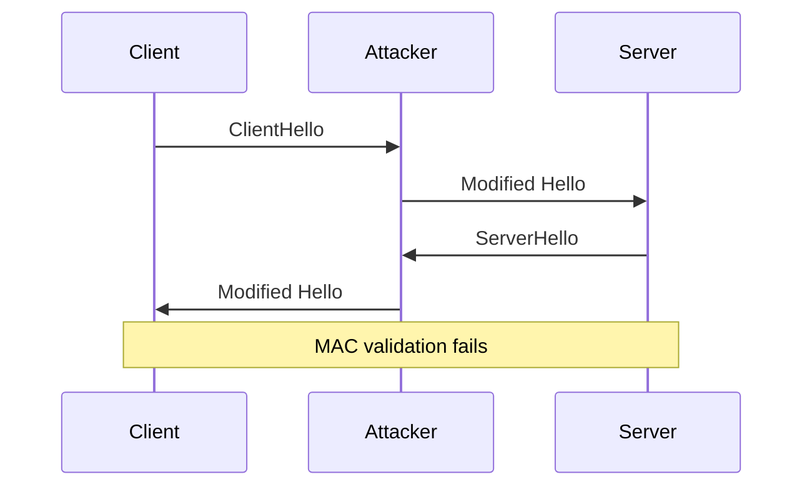
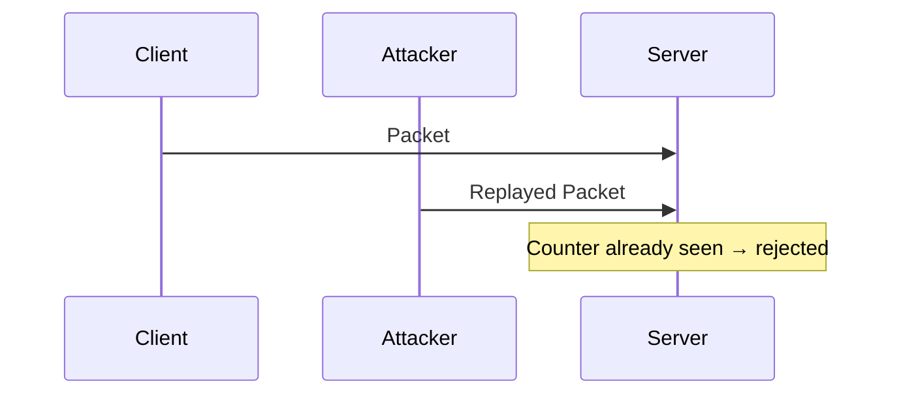
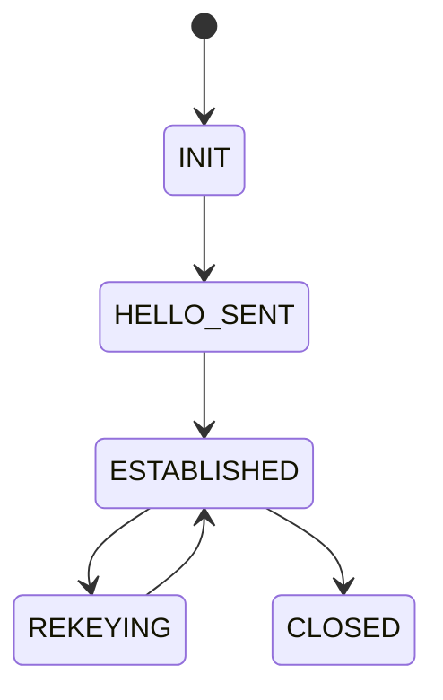

# 🔐 EELP — Evolutionary Efficient Lightweight Protocol

<p align="center">


</p>

<p align="center">
Minimalistic • Evolvable • Secure • Embedded-Optimized
</p>

---

# 📖 Overview

**EELP** — лёгкий криптографический протокол для устройств с ограниченными ресурсами.

Разработан для:

- IoT-устройств  
- микроконтроллеров  
- low-power сетей  
- embedded-гейтвеев  

Цель — обеспечить защищённое соединение с минимальной реализацией и возможностью крипто-эволюции.

---

# 🎯 Design Goals

- ≤ 32–64 KB Flash  
- ≤ 8–16 KB RAM  
- 1-RTT handshake  
- Forward Secrecy  
- Anti-Replay  
- Downgrade Protection  
- Crypto Agility  
- Нет X.509  
- Нет ASN.1  
- Минимальный state machine  

---

# 🧠 Cryptographic Stack

| Назначение | Алгоритм |
|------------|----------|
| Key Exchange | X25519 |
| AEAD | ChaCha20-Poly1305 |
| KDF | HKDF-SHA256 |
| Hash | SHA-256 |

---

# 📡 Handshake (1 RTT)



---

# 🖥 Deployment Scheme (Two Devices)



---

# ⚔ Threat Model — Attack Scenarios

## 1️⃣ MITM Attack Attempt



**Защита:**
- Подпись / MAC сервера
- HKDF context binding (version + suite)
- Эфемерные ключи (Forward Secrecy)

---

## 2️⃣ Downgrade Attack Attempt


**Защита:**

Версия включается в HKDF context:

```
context = version || crypto_suite_id
```

Любая модификация версии ломает MAC.

---

## 3️⃣ Replay Attack Attempt



**Защита:**

- Монотонный счётчик
- Sliding window (32 пакета)
- Bitmap отслеживания
- Минимум RAM

---

# 🛡 Defense Model Summary

| Attack Type | Defense Mechanism |
|-------------|-------------------|
| MITM | Ephemeral ECDH + MAC |
| Downgrade | HKDF context binding |
| Replay | Counter + Sliding Window |
| Key Compromise | Forward Secrecy |
| Long-term leakage | Rekey rotation |

---

# 🔑 Key Derivation

```text
shared_secret = X25519(client_priv, server_pub)

master_key = HKDF(
    shared_secret,
    client_random || server_random,
    context = version || crypto_suite_id
)
```

---

# 🔐 Encrypted Packet Format

```c
struct {
    uint32  counter;
    uint8   ciphertext[n];
    uint8   tag[16];
}
```

---

# 🔁 Rekey Mechanisms

### Lightweight Rekey

```
session_key = HKDF(session_key, "rekey")
```

### Runtime Upgrade

```c
REKEY_REQUEST {
    new_crypto_suite;
    ephemeral_pubkey;
}
```

---

# 🧬 Crypto Evolution Model

| Version | Crypto |
|----------|--------|
| v1 | X25519 + ChaCha20 |
| v2 | Hybrid PQC |
| v3 | Post-Quantum |

---

# 🏗 State Machine



---

# 🧮 Estimated Footprint

| Component | Flash |
|-----------|--------|
| X25519 | ~8–12 KB |
| ChaCha20-Poly1305 | ~6–8 KB |
| SHA256 + HKDF | ~5 KB |
| Protocol logic | ~5 KB |
| **Total** | ~25–35 KB |

RAM: 4–8 KB

---

# 🔐 Security Properties

- ✔ Forward Secrecy  
- ✔ MITM Resistance  
- ✔ Downgrade Protection  
- ✔ Anti-Replay  
- ✔ Rekey Support  
- ✔ Crypto Agility  

---

# 👤 Author

**Protocol Idea:** nestren  
**Project:** EELP — Evolutionary Efficient Lightweight Protocol  

---

# 📜 License

MIT License

---

⚠ Conceptual cryptographic design. 
